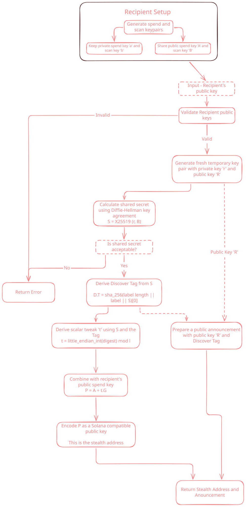

<h1 align="center">stealth-keygen</h1>

`stealth-keygen` is a Rust library for generating recipient spend and scan keypairs, deriving one-time payment public keys, recovering their private signing scalars, and signing messages with the recovered keys. A sender uses the recipient's public keys and fresh randomness to derive a destination and a public announcement. The recipient uses their private keys and that announcement to recover the matching payment key. All key calculations happen off-chain.

  

A matching discovery tag identifies a candidate; the recipient must check the destination authority before accepting a payment.

This library explores stealth key generation as a step toward building our Turbin3 Builders capstone project.

## Dependencies

- `curve25519-dalek` — Edwards point and scalar arithmetic for spend and payment keys.
- `rand_core` — Cryptographic RNG traits for generating key material.
- `sha2` — SHA-2 hashing for discovery tags, scalar tweaks, and signing.
- `x25519-dalek` — X25519 key agreement, with the `static_secrets` feature enabled.
- `zeroize` — Clearing sensitive key material and temporary buffers from memory.
