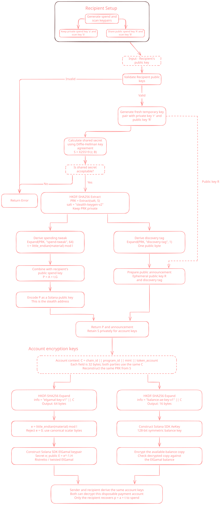

<h1 align="center">stealth-keygen</h1>

`stealth-keygen` is a Rust library for generating recipient spend and scan keypairs, deriving one-time payment public keys, recovering their private signing scalars, and signing messages with the recovered keys. A sender uses the recipient's public keys and fresh randomness to derive a destination and a public announcement. The recipient uses their private keys and that announcement to recover the matching payment key. All key calculations happen off-chain.

  

A matching discovery tag identifies a candidate; the recipient must check the destination authority before accepting a payment.

This library explores stealth key generation as a step toward building our Turbin3 Builders capstone project.

## Key derivation

`derive_payment(&public_keys, &mut rng)` uses HKDF-SHA256 with the fixed public
salt `stealth-keygen-v2` and separate `discovery-tag` and `spend-tweak` labels.
Announcements contain only the ephemeral public key and discovery tag; neither
a salt nor a scheme identifier needs to be included.

The original SHA-256-only derivation is no longer supported. Existing stealth-address HKDF
outputs are unchanged. Sender and recipient can also derive a shared ElGamal
keypair with `derive_elgamal_keypair(&context)`. The context binds the key to a
chain, application program, mint, and token account. Both parties can decrypt
that account; only the recipient holds the payment signing key.

`derive_balance_key(&context)` derives the separate symmetric `AeKey` for the
encrypted available-balance copy, using the `balance-ae-key-v1` label. Both
methods are available on `SenderPayment` and `RecoveredPayment` and use the
same `ElGamalContext`. The client must check a decrypted balance copy against
the ElGamal balance before trusting it. Encryption, proof generation, and
account operations belong to the consuming application.

## Dependencies

- `curve25519-dalek` — Edwards point and scalar arithmetic for spend and payment keys.
- `hkdf` — HKDF-SHA256 extraction and expansion for discovery tags, spending tweaks, and account encryption keys.
- `rand_core` — Cryptographic RNG traits for generating key material.
- `sha2` — SHA-2 hashing for discovery tags, scalar tweaks, and signing.
- `x25519-dalek` — X25519 key agreement, with the `static_secrets` feature enabled.
- `solana-zk-sdk` — Solana-compatible ElGamal key types and symmetric balance encryption.
- `zeroize` — Clearing sensitive key material and temporary buffers from memory.

## Tests

Run `cargo test --locked` for unit tests and the public payment-flow integration
tests. Signatures are checked with `ed25519-dalek`, a test-only dependency.
Fixed vectors and their independent Python generator are documented in
[tests/fixtures/README.md](tests/fixtures/README.md).
